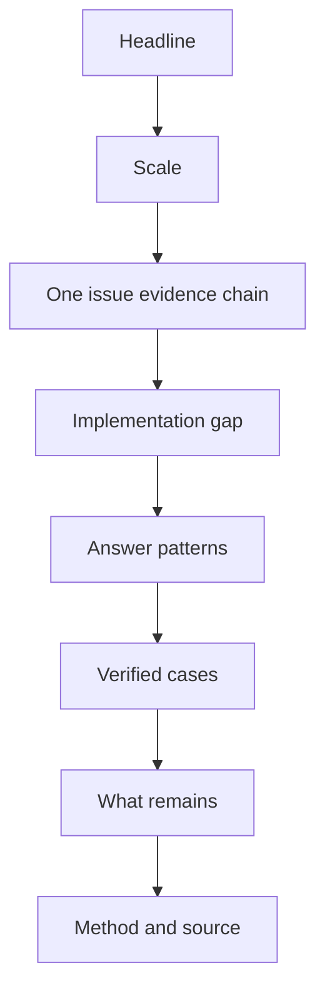
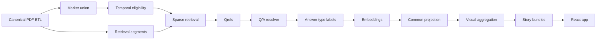
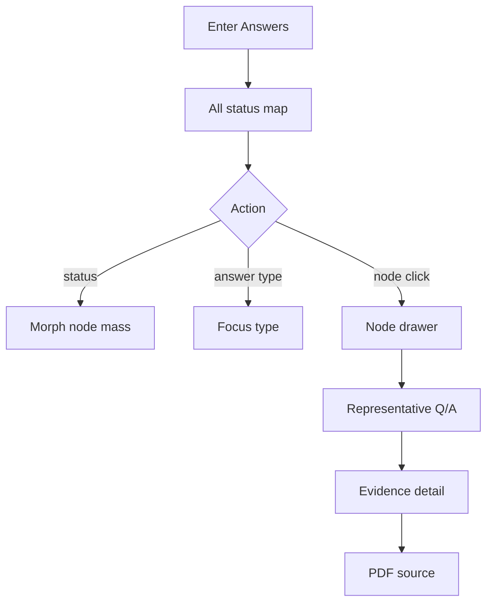
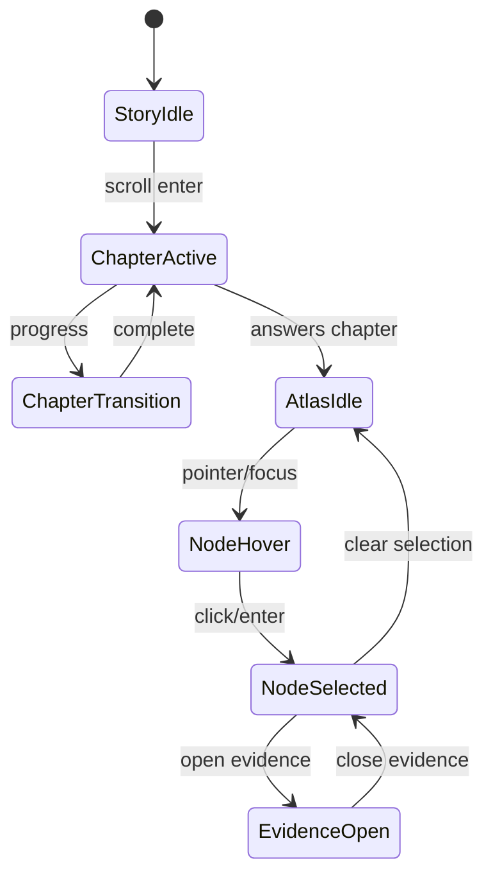
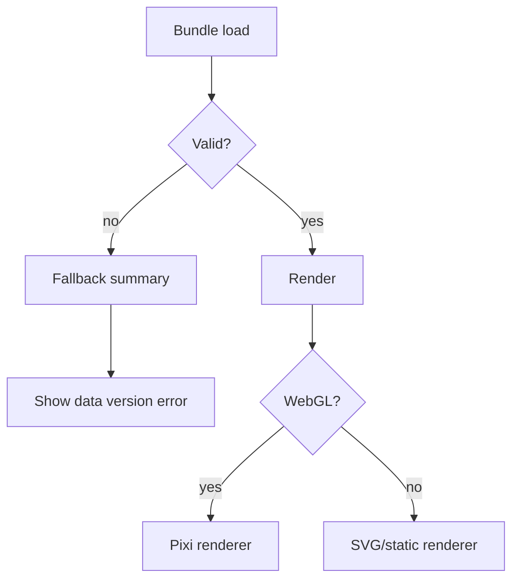

# 문체위 국정감사 6년
## Editorial Scrollytelling PRD · VID · SRD v3.0

> 공식 처리결과를 기준으로 과거 국정감사 질의·답변을 시간 누수 없이 복원하고,  
> 요구–답변–처리결과 사이의 간극을 하나의 증거선과 인터랙티브 의미공간으로 보여 주는 데이터 작품.

---

# 문서 인덱스

1. [Document Control](#1-document-control)
2. [Executive Summary](#2-executive-summary)
3. [프로젝트 피벗과 핵심 결정](#3-프로젝트-피벗과-핵심-결정)
4. [현재 에셋·준비도·전제](#4-현재-에셋준비도전제)
5. [레퍼런스·오픈소스 웹 그라운딩](#5-레퍼런스오픈소스-웹-그라운딩)
6. [PRD — 작품·제품 요구사항](#6-prd--작품제품-요구사항)
7. [Narrative Architecture](#7-narrative-architecture)
8. [IA — 정보구조](#8-ia--정보구조)
9. [사이트맵·라우트](#9-사이트맵라우트)
10. [유저 시나리오](#10-유저-시나리오)
11. [화면별 상세 기능명세](#11-화면별-상세-기능명세)
12. [플로우차트](#12-플로우차트)
13. [와이어프레임](#13-와이어프레임)
14. [SRD — 데이터사이언스·시스템 요구사항](#14-srd--데이터사이언스시스템-요구사항)
15. [공간·노드·센트로이드 수학적 정의](#15-공간노드센트로이드-수학적-정의)
16. [데이터 모델·TypeScript 클래스](#16-데이터-모델typescript-클래스)
17. [파라미터 레지스트리](#17-파라미터-레지스트리)
18. [데이터 전달·API 계약](#18-데이터-전달api-계약)
19. [프론트엔드 시스템 아키텍처](#19-프론트엔드-시스템-아키텍처)
20. [인터랙티브 함수 명세](#20-인터랙티브-함수-명세)
21. [VID — 비주얼·인터랙션 디자인](#21-vid--비주얼인터랙션-디자인)
22. [정보위계·타입·인포그래픽 시스템](#22-정보위계타입인포그래픽-시스템)
23. [디자인시스템 — 5단계 뎁스](#23-디자인시스템--5단계-뎁스)
24. [Storybook 명세](#24-storybook-명세)
25. [접근성·성능·테스트](#25-접근성성능테스트)
26. [분석·시각화 리스크](#26-분석시각화-리스크)
27. [제작 로드맵·Gate](#27-제작-로드맵gate)
28. [권장 저장소 구조](#28-권장-저장소-구조)
29. [상용 배포 완료 기준](#29-상용-배포-완료-기준)
30. [Decision Log](#30-decision-log)
31. [웹 레퍼런스](#31-웹-레퍼런스)

---

# 1. Document Control

| 항목 | 값 |
|---|---|
| 문서 목적 | 데이터·편집·UX·프론트·인터랙션을 하나의 실행 명세로 통합 |
| 기준 작품 | 문체위 국정감사 회의록과 시정·처리결과 보고서 |
| 형식 | 단일 장편 인터랙티브 데이터 에세이 |
| 중심 레퍼런스 | `18 Years of Büro` |
| 기존 기획 | Atlas-first 3상태 비교 |
| 피벗 기획 | Editorial journey + Evidence Line + Atlas chapter |
| SSOT 원칙 | marker → segment → turn → block → page → PDF 역추적 |
| 화면 상태 | 전체 / 진행 / 완료 / 미확정 |
| 연도 역할 | 화면 분할이 아닌 temporal eligibility proxy |
| 주요 관객 | 일반 관객, 데이터저널리즘 관객, 연구·감사 관객 |
| 주요 기기 | Desktop 우선, Tablet·Mobile 완전 대응 |
| 렌더링 | DOM + SVG + PixiJS Canvas/WebGL |
| 3D | 핵심 데이터에는 사용하지 않음. 선택적 장면 전환만 허용 |
| 배포 | 정적 호스팅 우선 |
| 데이터 업데이트 | 빌드타임 고정 버전 |

## 1.1 문서 계층

```text
L0  Executive / 승인 결정
L1  PRD / VID / SRD
L2  IA / 화면 / 데이터 / 시스템
L3  컴포넌트 / 함수 / 파라미터
L4  테스트 / 완료 조건 / 운영 계약
```

## 1.2 용어

| 용어 | 정의 |
|---|---|
| Marker | 처리결과보고서에서 선별된 시정 요구 이슈 |
| Segment | 회의록 검색용 turn 또는 인접 turn 조합 |
| Q/A Pair | 관련 질의 turn과 답변 turn의 검증된 연결 |
| Evidence Chain | marker–질의–답변–결과–PDF를 잇는 provenance |
| Evidence Line | 작품 전체를 관통하는 시각·서사적 연결선 |
| Topic Space | 질문·요구가 무엇에 관한 것인지 표현하는 의미공간 |
| Behavior Layer | 답변이 어떻게 반응했는지 표현하는 다중라벨 층 |
| Atlas | topic 위치 위에 behavior mass를 겹쳐 보는 분석 챕터 |
| Centroid | 고차원 벡터 집단의 평균 방향 |
| Barycenter | 2차원 화면 좌표의 가중 무게중심 |
| Medoid | 실제 사례 중 집단 중심과 가장 가까운 대표 원문 |
| Node | 화면 목적에 따라 evidence event 또는 behavior aggregate를 표현하는 glyph |

---

# 2. Executive Summary

## 2.1 중심 질문

> 국정감사에서 요구된 문제는 어떤 답변을 거쳐, 어떤 처리결과로 남았는가?

작품은 두 개의 간극을 추적한다.

```text
이행의 간극
요구 → 처리결과

답변의 간극
질문 → 직접적·구체적 답변
```

두 간극은 동시에 보여 주되 인과관계로 합치지 않는다.

## 2.2 작품의 한 문장 정의

> 공식 처리결과를 기준점으로 과거의 관련 질의·답변을 검색·복원하고, 당시의 답변행태와 후속 처리상태를 원문 증거와 함께 탐색하게 하는 인터랙티브 데이터 에세이.

## 2.3 핵심 경험

```text
강한 헤드라인
→ 분석 규모
→ 한 이슈의 Evidence Chain
→ 이행의 간극
→ 답변유형 Atlas
→ 대표 사례
→ 남은 질문
→ 방법·원문
```

## 2.4 핵심 시각 오브젝트

### 작품 전체

`Evidence Line`

### 분석 챕터

`Topic Atlas + Behavior Nodes`

### 증거 확인

`Evidence Drawer`

## 2.5 성공 정의

이 작품은 다음이 가능할 때 성공한다.

1. 관객이 데이터 파이프라인을 몰라도 문제를 이해한다.
2. 스크롤만으로 주요 논증을 따라갈 수 있다.
3. 추상적 노드를 클릭하면 실제 질문·답변·PDF까지 내려간다.
4. 완료·진행·미확정의 차이를 동일 좌표에서 비교한다.
5. 미래 회의록이 검색에 들어오지 않는다.
6. 노드 크기·색·거리의 의미가 수학적 정의와 구현에서 일치한다.
7. 분석 결과를 인과로 과장하지 않는다.

---

# 3. 프로젝트 피벗과 핵심 결정

## 3.1 기존 Atlas-first

```text
Landing
→ ACTIVE / COMPLETE / UNRESOLVED
→ Node
→ Evidence
```

문제:

- 첫 진입부터 추상공간을 이해해야 함
- 기사와 발표의 논지가 약해질 수 있음
- 작품보다 분석 대시보드로 보일 위험
- 시간·사건·원문이 주변 기능으로 밀림

## 3.2 Editorial journey

```text
Question
→ Scale
→ Record
→ Gap
→ Answers
→ Cases
→ Remains
```

결정:

- Atlas는 `Answers` 챕터에 집중
- 기본 경험은 읽기·따라가기
- 분석은 필요할 때 열기
- 연도는 서사적 milestone 또는 eligibility로만 사용
- 작품 전체의 선은 provenance를 의미

## 3.3 고정 결정

| ID | 결정 |
|---|---|
| D-001 | 작품은 단일 long-form page다. |
| D-002 | 증거선이 전체 서사를 연결한다. |
| D-003 | Atlas는 핵심 챕터이지만 전체 IA는 아니다. |
| D-004 | 공간 좌표는 force graph가 아니라 공통 embedding projection이다. |
| D-005 | 답변유형은 multi-label이다. |
| D-006 | 연도는 미래정보 차단에 사용하며 관객용 비교축으로 강제하지 않는다. |
| D-007 | 완료·진행·미확정은 동일 공간에서 morph한다. |
| D-008 | 상태별 projection을 별도로 fit하지 않는다. |
| D-009 | node size는 단순 segment 수가 아닌 deduped weighted mass다. |
| D-010 | 원문 추적이 없는 노드는 공개 화면에 올리지 않는다. |
| D-011 | `회피`는 편집적 상위 표현이며 모델 label은 관찰형 용어를 쓴다. |
| D-012 | 3D는 데이터 깊이가 아닌 장면 전환에만 제한한다. |
| D-013 | 일반 관객 control은 한 화면 최대 4개다. |
| D-014 | 분석 parameter는 advanced drawer에 둔다. |
| D-015 | 결과보고서의 `완료`를 실제 완료로 자동 승인하지 않는다. |

---

# 4. 현재 에셋·준비도·전제

## 4.1 확보된 구조 자산

| 레이어 | 현재 알려진 규모 | 상태 |
|---|---:|---|
| Registry | 42 | 확보 |
| PDF | 42 | 확보 |
| Page | 4,495 | 검증 |
| Block | 293,717 | 검증 |
| Speaker turn | 65,590 | 검증 |
| Retrieval segment | 196,686 | 검증 |
| Segment traceability | 1.0 | 통과 |
| Marker | 2020·2022·2024 | 보유 |
| 2020 marker | 110 | 보유 |
| 2024 marker | 71 | 보유 |
| Qrels | 미완성 | 추가 구축 |
| Q/A Pair | 미완성 | 추가 구축 |
| Answer type Gold | 미완성 | 추가 구축 |
| Completion verification | 미완성 | 대표 사례 수작업 |

## 4.2 작품 제작 전 데이터 필수조건

```text
Canonical ETL PASS
Target union PASS
Temporal leakage = 0
Qrels 평가 완료
Q/A pair 검증 완료
Answer type guideline 고정
Projection reproducibility 확인
Evidence route 100%
```

## 4.3 전제

- 처리결과 status는 공식 보고의 상태이며 실재 결과와 동일하다고 자동 가정하지 않는다.
- 연도별 marker는 동일한 schema로 union한다.
- 동일 answer turn이 여러 segment에서 검색될 수 있다.
- 동일 answer가 여러 marker와 연결될 수 있다.
- UMAP은 표시용이며 실제 유사도 계산은 원래 embedding 공간에서 한다.
- 답변유형은 한 답변에 여러 개가 겹칠 수 있다.

---

# 5. 레퍼런스·오픈소스 웹 그라운딩

## 5.1 Main reference — 18 Years of Büro

채택 요소:

- chaptered journey
- long-form scroll
- timeline as navigation
- grid-first layout
- negative space
- interactive dots·lines·glyphs
- WebGL-powered experiential layer
- 일부 장면의 inverted scroll
- 서사와 시각 시스템의 통합

번역:

| Büro | 본 작품 |
|---|---|
| studio history | audit evidence history |
| milestone | marker / Q/A / result event |
| interactive dot | evidence or answer mass |
| chapter | 논증 단위 |
| year line | evidence line |
| case detail | evidence drawer |
| WebGL sound glyph | data glyph and morph |
| dark ages | unresolved / uncertain chapter |

## 5.2 오픈소스 도구 평가

| 도구 | 채택 | 사용 위치 | 판단 |
|---|---|---|---|
| React | 필수 | UI shell | 컴포넌트·상태 기반 화면 구성 |
| TypeScript | 필수 | 전역 | 데이터 계약·상태 안전성 |
| Vite | 필수 | build | 정적 인터랙티브 배포와 빠른 개발 |
| D3 | 필수 | scale·geometry·zoom | 맞춤형 data-driven graphics |
| PixiJS | 권장 | Atlas canvas | 고성능 2D WebGL/WebGPU 렌더링 |
| GSAP | 권장 | scroll choreography | DOM·SVG·Canvas·WebGL 통합 모션 |
| Scrollama | 선택 | discrete step state | IntersectionObserver 기반 step activation |
| Storybook | 필수 | UI QA | 독립 컴포넌트·상태·테스트 |
| Zustand | 권장 | state | 작은 전역 상태와 시각 상태 관리 |
| Sigma.js | 감사뷰만 | raw network | 대형 WebGL graph에 적합하나 custom glyph 난도 |
| Graphology | 감사뷰만 | graph data | 관계 데이터·알고리즘 |
| Cytoscape.js | 감사뷰만 | relation analysis | graph theory와 layout이 필요할 때 |
| Reagraph | 프로토타입 | React WebGL graph | 빠른 graph PoC |
| React Flow | 사용 안 함 | — | 편집형 node UI에 강하나 본 작품은 editor가 아님 |
| Observable Plot | QA용 | static summary | 빠른 통계 시각 검산 |
| Three.js/R3F | 제한적 | intro transition | 실제 z 의미가 없으므로 본 데이터에는 사용 안 함 |

## 5.3 최종 기술 선택

```text
App shell            React + TypeScript + Vite
Routing              React Router
State                Zustand
Editorial content    MDX or typed JSON
Scroll state         Scrollama OR IntersectionObserver
Animation            GSAP timeline
Main data map        PixiJS
Scale / projection   D3
Small charts         D3/SVG or Observable Plot export
Worker               Web Worker
Component QA         Storybook
E2E                  Playwright
Static hosting       Vercel / Cloudflare Pages / GitHub Pages compatible
```

## 5.4 도구 사용 원칙

- Scrollama와 GSAP이 같은 element를 동시에 pin하지 않는다.
- Scrollama는 state trigger, GSAP은 transition을 담당한다.
- D3는 데이터 변환·scale·zoom을 담당하고 PixiJS는 노드를 그린다.
- Sigma.js는 embedding projection을 대체하지 않는다.
- 3D 카메라 이동이 좌표 의미를 바꾸지 않게 한다.
- 모든 Canvas 정보는 DOM summary와 evidence list를 제공한다.

---

# 6. PRD — 작품·제품 요구사항

## 6.1 문제

공식 처리결과보고서는 시정 요구를 `완료`, `진행`, `향후계획` 등으로 기록한다. 그러나 일반 관객은 다음을 한 번에 보기 어렵다.

1. 무엇이 요구됐는가
2. 당시 어떤 질문과 답변이 있었는가
3. 답변은 직접적이었는가
4. 이후 어떻게 보고됐는가
5. 완료의 근거는 무엇인가

## 6.2 작품 목표

### G1

공식 결과와 당시 발언을 하나의 증거 흐름으로 연결한다.

### G2

이행의 간극과 답변의 간극을 구분해 보여 준다.

### G3

처리상태별 답변행태 분포를 동일 공간에서 비교한다.

### G4

추상적 패턴을 원문으로 검산하게 한다.

### G5

기사·발표·시각화가 하나의 매체에서 작동하게 한다.

## 6.3 비목표

- 개인별 책임 순위
- 정치적 성향 추론
- 답변 유형만으로 처리결과 예측
- 인과효과 추정
- 실시간 국정감사 모니터링
- 사용자 임의 데이터 업로드
- 자유 편집형 graph builder
- `완료` 보고를 자동으로 허위 판정

## 6.4 핵심 관객

### A1 일반 관객

- 문제 규모와 대표 사례를 이해
- 스크롤 중심
- 분석 설정을 보지 않음

### A2 데이터저널리즘 독자

- 패턴과 수치 비교
- 노드·사례 탐색
- 방법·한계 확인

### A3 연구·감사 관객

- qrels·confidence·dedupe 확인
- 원문과 source metadata 검산
- advanced controls 사용

## 6.5 Must / Should / Could / Won’t

### Must

- long-form scroll story
- chapter progress
- Evidence Line
- 처리상태 분포
- one-issue Evidence Chain
- Atlas chapter
- 답변유형 toggle
- 노드 hover / select
- evidence drawer
- PDF provenance
- keyboard navigation
- reduced motion
- mobile fallback
- method / limitation

### Should

- completion verification cases
- shareable case link
- status morph animation
- chapter deep link
- static figure export
- presentation mode
- analysis mode

### Could

- ambient sound opt-in
- Three.js camera intro
- raw network audit
- audio reading
- bilingual captions

### Won’t v1

- user login
- database server
- live CMS
- real-time model inference
- per-person blame score
- unverified strong claims

## 6.6 KPI / 품질 목표

### Editorial

- 10초 내 중심 질문 이해
- 90초 내 첫 Evidence Chain 완료
- 5분 내 핵심 논증 전체 경험

### Data

- temporal leakage 0
- provenance coverage 100%
- target-answer dedupe 오류 0
- qrels Recall@20 목표 0.90
- Q/A precision 목표 0.95
- answer-type label agreement 기준 설정

### UX

- legend comprehension 80% 이상
- node → evidence 전환 성공 70% 이상
- keyboard-only 핵심 흐름 완료
- mobile에서 모든 원문 접근

### Performance

- 초기 콘텐츠 우선 표시
- visualization lazy load
- 60fps 목표, 저사양 30fps 이상 fallback
- drawer interaction 150ms 내 반응

---

# 7. Narrative Architecture

## 7.1 전체 챕터

```text
00 Prologue      질문은 남았다
01 Scale         요구는 얼마나 쌓였나
02 Record        요구에서 결과까지
03 Gap           완료와 진행의 경계
04 Answers       어떻게 답했나
05 Cases         완료라고 쓰였지만
06 Remains       끝나지 않은 문장
07 Method        어떻게 만들었나
```

## 7.2 Chapter 00 — Prologue

### Thesis

```text
국정감사는 요구를 남긴다.
기관은 답한다.
결과보고서는 완료와 진행을 기록한다.
그 사이에는 무엇이 남았을까.
```

### Visual state

- blank field
- one line
- three words: 요구 / 답변 / 결과
- first marker enters

### Interaction

- 0–30% line draw
- 30–70% labels appear
- 70–100% scroll cue

## 7.3 Chapter 01 — Scale

### Data

- marker count
- status count
- PDF / page / turn / segment 규모
- 대상 범위

### Visual

- marker dots accumulating on Evidence Line
- 숫자는 문장과 결합
- year labels는 contextual milestone

### Editorial requirement

분석대상 marker와 전체 국정감사 요구를 혼동하지 않는다.

## 7.4 Chapter 02 — Record

### Main case

```text
Marker
→ Candidate segments
→ Question
→ Answer
→ Result
→ PDF page
```

### Visual

- block fragments merge into turn
- turn pair becomes Q/A
- line lands on result card

### Function

관객이 이 작품의 데이터 연결을 직관적으로 이해한다.

## 7.5 Chapter 03 — Gap

### Thesis

완료와 진행은 결과표의 라벨이지만, 문장과 근거의 경계는 항상 선명하지 않을 수 있다.

### Visual

- one line splits into status lanes
- ambiguous records hover between lanes
- completion evidence tags appear

### Data requirements

- reported status
- evidence specificity
- external verification
- source count
- verification note

## 7.6 Chapter 04 — Answers

### Thesis

비슷한 질문 영역에서 어떤 답변 유형이 반복됐는가.

### Atlas mode

- shared topic space
- behavior mass nodes
- default all status
- status morph
- answer type filter

### Story sequence

1. raw answer points
2. topic regions
3. behavior colors
4. node mass
5. status transition
6. selected evidence

## 7.7 Chapter 05 — Cases

### Case template

```text
요구
→ 당시 답변
→ 공식 처리상태
→ 추가 검증
→ 판단 한계
```

### Case count

3–5

### Case types

- concrete complete
- ambiguous complete
- long-running active
- active without future plan
- repeated review/coordination answer

## 7.8 Chapter 06 — Remains

### Visual

- complete lines close
- active lines continue
- unresolved lines break
- recurring phrases float in restrained form

### Editorial ending

분포를 요약하지만 원인을 단정하지 않는다.

## 7.9 Chapter 07 — Method

- data scope
- temporal rule
- retrieval
- Q/A
- taxonomy
- embedding
- node aggregation
- limitations
- downloads

---

# 8. IA — 정보구조

## 8.1 기본 IA

```text
L0 작품 질문
├─ L1 서사 챕터
│  ├─ L2 주장
│  │  ├─ L3 시각 장면
│  │  │  └─ L4 수치·원문·출처
│  │  └─ L3 사례
│  │     └─ L4 Evidence Chain
│  └─ L2 분석 챕터
│     ├─ L3 Topic region
│     │  └─ L4 Behavior node
│     └─ L3 Status comparison
│        └─ L4 Node members
└─ L1 Method
   ├─ L2 Data
   ├─ L2 Model
   ├─ L2 Validation
   └─ L2 Limitation
```

## 8.2 관객 정보 밀도

```text
D0  헤드라인·핵심 장면
D1  상태·대표 수치
D2  노드·유형·대표 문장
D3  전체 Q/A·confidence
D4  PDF·ID·모델·파라미터
```

## 8.3 Progressive disclosure

- 기본 서사: D0–D1
- hover: D2
- click drawer: D2–D3
- method/analysis: D3–D4

---

# 9. 사이트맵·라우트

## 9.1 사이트맵

```text
/
├─ #prologue
├─ #scale
├─ #record
├─ #gap
├─ #answers
├─ #cases
├─ #remains
├─ /case/:caseId
├─ /evidence/:evidenceId
├─ /method
├─ /data
└─ /about
```

## 9.2 라우트 계약

| Route | 목적 | URL state |
|---|---|---|
| `/` | 전체 작품 | chapter hash |
| `/#answers` | Atlas chapter direct | status, type |
| `/case/:caseId` | 편집 사례 | case id |
| `/evidence/:evidenceId` | 전체 증거 | evidence id |
| `/method` | 방법론 | version |
| `/data` | 데이터 범위·다운로드 | artifact version |
| `/about` | 크레딧 | 없음 |

## 9.3 Hash / Query

```text
/#answers?status=active&type=A5
/evidence/EVD-2024-0026
/method?section=centroid
```

URL이 필터 전체를 복원하지 못하더라도 selected evidence는 반드시 복원한다.

---

# 10. 유저 시나리오

## 10.1 Scenario A — 일반 관객

1. 헤드라인을 본다.
2. 스크롤로 요구–답변–결과 구조를 배운다.
3. 분석 규모를 확인한다.
4. 한 대표 사례의 Q/A를 읽는다.
5. Gap 챕터에서 완료·진행의 경계를 본다.
6. Atlas에서 큰 빨강/파랑/중간 노드를 본다.
7. 노드를 클릭해 대표 답변을 읽는다.
8. Cases에서 실제 검증 사례를 본다.
9. Remains에서 결론을 읽는다.

## 10.2 Scenario B — 데이터저널리즘 관객

1. chapter nav로 Answers 진입.
2. A5 `검토·협의 유보` 유형을 선택.
3. 전체 → complete → active morph를 관찰.
4. node size와 normalized mass를 비교.
5. representative answer를 연다.
6. question과 status를 비교.
7. method에서 중복 보정과 시간 필터 확인.

## 10.3 Scenario C — 연구·감사자

1. Analysis mode 활성화.
2. raw points 표시.
3. confidence threshold 확인.
4. node member list 열기.
5. link source segment와 answer turn 검산.
6. qrels label 확인.
7. PDF page 확인.
8. data artifact version 기록.

## 10.4 Scenario D — 발표자

1. Presentation mode 진입.
2. chapter snap 사용.
3. 각 챕터의 핵심 장면에서 잠시 멈춤.
4. Answers에서 상태 morph 시연.
5. Case drawer로 대표 원문 제시.
6. Method summary로 마무리.

## 10.5 Scenario E — 모바일 관객

1. 세로 본문 읽기.
2. sticky graphic 대신 inline snapshots 경험.
3. Atlas는 상태 tab 방식.
4. node 선택 후 bottom sheet.
5. PDF는 새 탭 또는 text transcript.

---

# 11. 화면별 상세 기능명세

## S00 App Shell

### 기능

- chapter progress
- skip to content
- motion toggle
- chapter menu
- method link
- current data version

### 상태

- default
- menu open
- reduced motion
- offline fallback

## S01 Prologue

### 기능

- headline reveal
- line intro
- scroll cue
- presentation mode CTA

### 이벤트

```text
PROLOGUE_ENTER
PROLOGUE_PROGRESS
PROLOGUE_COMPLETE
```

## S02 Scale

### 표시

- marker total
- status totals
- PDF/page/turn/segment
- scope note

### 기능

- metric reveal
- milestone hover
- source caption

### empty state

데이터 수치가 빌드타임 계약과 불일치하면 차트를 숨기고 오류 메시지를 표시한다.

## S03 Record / Evidence Demonstration

### 구성

- marker card
- search candidates
- question turn
- answer turn
- result card
- source page

### 기능

- play/pause
- step backward/forward
- open source
- text size control

## S04 Gap

### 구성

- status lanes
- marker cards
- evidence specificity tags
- verification badge

### 기능

- hover ambiguous
- compare wording
- open case
- filter external verification state

## S05 Answers Atlas

### 기본 view

- whole shared space
- all statuses
- aggregated nodes
- marker and answer centroids
- minimal legend

### 관객 controls

1. status
2. answer type
3. node size explanation
4. reset

### analysis controls

- confidence
- mass mode
- raw points
- centroid
- density
- dedupe mode
- projection metadata

## S06 Atlas Node Drawer

### 위계

1. type name
2. normalized mass
3. raw answer count
4. representative answers
5. dominant topics
6. mean similarity
7. confidence
8. evidence link

### 기능

- next representative
- all members
- pin
- permalink
- close

## S07 Case Strip

### 기능

- horizontal case sequence
- keyboard buttons
- case evidence indicators
- open case full view

### 주의

native horizontal scroll을 가로채지 않는다. 명시적 버튼과 CSS snap을 사용한다.

## S08 Evidence Detail

### 표시

```text
Marker issue
Question
Answer
Result report
Verification
Provenance
```

### 기능

- PDF open
- copy citation
- prev/next evidence
- annotation confidence
- report data issue

## S09 Remains

### 기능

- summary metrics
- repeated phrase reveal
- method CTA
- data CTA
- credits

## S10 Method

### sections

- scope
- SSOT
- temporal eligibility
- retrieval
- qrels
- Q/A
- answer type
- embeddings
- projection
- centroid/node
- limitations

## S11 Data

- artifact version
- row counts
- hashes
- coverage
- licenses
- downloadable tables
- no raw personal data

---

# 12. 플로우차트

## 12.1 Editorial flow



## 12.2 Data flow



## 12.3 Atlas user flow



## 12.4 Interaction state



## 12.5 Failure flow



---

# 13. 와이어프레임

## 13.1 Desktop — Prologue

```text
┌────────────────────────────────────────────────────────────────────────────┐
│ [00/06]                                                        [Menu]     │
│                                                                            │
│      “검토하겠습니다”                                                      │
│      6년 뒤, 무엇이 남았나                                                 │
│                                                                            │
│      문체위 국정감사 요구–답변–처리결과 추적                               │
│                                                                            │
│      ─────●────────●────────●────────────────────────────────────────      │
│           요구       답변       결과                                       │
│                                                                            │
│                                                     Scroll ↓               │
└────────────────────────────────────────────────────────────────────────────┘
```

## 13.2 Desktop — Scale

```text
┌────────────────────────────────────────────────────────────────────────────┐
│ 01 요구는 얼마나 쌓였나                                      18%           │
│                                                                            │
│ [Marker N]      [PDF 42]      [Turn 65,590]      [Segment 196,686]         │
│                                                                            │
│ 2020 ●●●●●●●●●●──────────────────────────────────────────────              │
│ 2022 ●●●●●●●●●●──────────────────────────────────────────────              │
│ 2024 ●●●●●●●●────────────────────────────────────────────────              │
│                                                                            │
│ ※ 마킹된 주요 시정 이슈를 분석 대상으로 삼았다.                           │
└────────────────────────────────────────────────────────────────────────────┘
```

## 13.3 Desktop — Record

```text
┌──────────────────────┬─────────────────────────────────────────────────────┐
│ Step 3 / 5           │                                                     │
│                      │     [시정 요구]                                     │
│ 처리결과 마커        │          │                                          │
│ 관련 질의            │     [질문 turn]                                    │
│ 답변                 │          │                                          │
│ 결과                 │     [답변 turn]                                    │
│ PDF                  │          │                                          │
│                      │     [처리결과] ── [PDF p.00]                        │
│ [이전] [다음]        │                                                     │
└──────────────────────┴─────────────────────────────────────────────────────┘
```

## 13.4 Desktop — Answers Atlas

```text
┌────────────────────────────────────────────────────────────────────────────┐
│ 04 어떻게 답했나                                        [전체][완료][진행] │
│ [기억][정보][타기관][비직접][검토][자료][조치][근거]          [Reset]      │
├────────────────────────────────────────────────────────────────────────────┤
│                                                                            │
│                  ☆ marker centroid                                        │
│                                                                            │
│        △ 정보 미보유              ○ 검토·협의                              │
│                                                                            │
│                  □ 구체 조치                 □ 근거 제시                   │
│                                                                            │
│        △ 타기관 귀속                                                     │
│                            ◎ matched answer centroid                       │
│                                                                            │
├────────────────────────────────────────────────────────────────────────────┤
│ 위치=질문 주제 · 크기=가중 빈도 · 색/형태=답변 방식                       │
└────────────────────────────────────────────────────────────────────────────┘
```

## 13.5 Desktop — Atlas with drawer

```text
┌──────────────────────────────────────────────────┬─────────────────────────┐
│ Atlas                                            │ 검토·협의 유보          │
│                                                  │                         │
│     ○○                                           │ 가중 질량 0.42          │
│        ○                                         │ 실제 답변 31            │
│                                                  │ 평균 유사도 0.71        │
│               ○ selected                         │                         │
│                                                  │ “관계기관과 협의해...”  │
│                                                  │ [질문·결과 보기]        │
│                                                  │                         │
│                                                  │ [전체 31개]             │
└──────────────────────────────────────────────────┴─────────────────────────┘
```

## 13.6 Desktop — Case

```text
┌────────────────────────────────────────────────────────────────────────────┐
│ Case 02 / 완료라고 쓰였지만                                                │
│                                                                            │
│ [요구]             [당시 답변]            [보고상태]         [검증]        │
│ 정책을 마련할 것    검토하겠습니다          완료               근거 모호     │
│                                                                            │
│                    “원문 인용...................................”          │
│                                                                            │
│ [PDF 회의록]  [결과보고서]  [검증 출처]                                  │
└────────────────────────────────────────────────────────────────────────────┘
```

## 13.7 Mobile — Atlas

```text
┌──────────────────────────────┐
│ 04 어떻게 답했나       [≡]  │
│ [전체][완료][진행][미확정]   │
│ [유형 선택 ▼]               │
├──────────────────────────────┤
│                              │
│          ☆                   │
│    △정보        ○검토        │
│          □조치               │
│                              │
├──────────────────────────────┤
│ ○ 검토·협의 유보             │
│ 답변 31 · target당 1.8       │
│ “관계기관과 협의해…”         │
│ [질문과 결과 보기]           │
└──────────────────────────────┘
```

## 13.8 Mobile — Evidence

```text
┌──────────────────────────────┐
│ ← 증거                       │
├──────────────────────────────┤
│ 시정 요구                    │
│ “........................”   │
├──────────────────────────────┤
│ 질문                         │
│ “........................”   │
├──────────────────────────────┤
│ 답변                         │
│ “........................”   │
├──────────────────────────────┤
│ 처리결과                     │
│ 완료 / 조치사항 / 계획       │
├──────────────────────────────┤
│ [원 PDF 열기]                │
└──────────────────────────────┘
```

---

# 14. SRD — 데이터사이언스·시스템 요구사항

## 14.1 Data pipeline

```text
P0 Canonical ETL
P1 Target schema union
P2 Temporal eligibility
P3 Sparse retrieval
P4 Qrels
P5 Q/A pair
P6 Answer behavior label
P7 Dense embedding
P8 Projection
P9 Aggregation
P10 Story bundle
```

## 14.2 시간 누수 방지

Target `i`, segment `j`:

\[
E_{ij}=\mathbb{1}(t_j^{meeting}\le t_i^{cutoff})
\]

엄격 정책:

\[
E_{ij}=1
\iff
cycle(j)=cycle(i)
\land
t_j^{meeting}\le t_i^{cutoff}
\]

### 구현

```text
eligible corpus 생성
→ vector similarity
```

금지:

```text
전체 corpus score 계산
→ 미래 결과만 화면에서 숨김
```

## 14.3 Query text

```text
query_core     = issue_text
query_expanded = issue_text + 0.25 × action_text
future_plan    = 기본 검색에서 제외
status         = 검색 입력에서 제외
```

## 14.4 Sparse retrieval

\[
S_{ij}^{sparse}
=
0.65S_{ij}^{char}
+
0.35S_{ij}^{word}
\]

- char n-gram: 3–5
- word n-gram: 1–2
- L2 normalize
- Top-K and threshold

## 14.5 Dense retrieval

\[
\tilde q_i=\frac{q_i}{\|q_i\|_2},
\quad
\tilde d_j=\frac{d_j}{\|d_j\|_2}
\]

\[
S_{ij}^{dense}=\tilde q_i^\top \tilde d_j
\]

## 14.6 Rank fusion

\[
RRF_{ij}
=
\sum_{m\in M}
\frac{1}{k+r_m(i,j)}
\]

Default:

```text
RRF_K = 60
```

## 14.7 Qrels

| label | 정의 |
|---:|---|
| 2 | 핵심 질의·답변 |
| 1 | 동일 논점 보조 문맥 |
| 0 | 무관 |

평가:

- Recall@5/10/20
- MRR
- nDCG@10
- marker coverage

## 14.8 Q/A resolver

\[
C^{qa}
=
0.35C_{role}
+
0.25C_{adjacency}
+
0.25C_{segment}
+
0.15C_{parse}
\]

규칙:

1. 질문자 role anchor이면 next non-procedural turn.
2. 답변자 role anchor이면 prev question turn.
3. 복수 answer turn은 span으로 묶는다.
4. 위원장 절차 발언을 제외한다.
5. 낮은 confidence는 Gold review 대상으로 보낸다.

## 14.9 Answer behavior labels

```text
A1 기억 부재 진술
A2 정보 미보유·확인 필요
A3 타기관·타주체 귀속
A4 질문 비직접 대응
A5 검토·협의 유보
A6 조사·자료 제출 절차
A7 구체 조치 약속
A8 완료·근거 제시
```

답변 `j`:

\[
p_j=[p_{j1},\dots,p_{j8}]
\]

- Gold: binary multi-hot
- model: sigmoid probability
- evidence span 필수

## 14.10 Completion verification

공식 status와 별도 레이어다.

```text
reported_status
verification_status
verification_method
verification_source
verification_date
verification_note
```

`verification_status`:

- confirmed_complete
- partly_complete
- evidence_insufficient
- contradicted
- not_reviewed

## 14.11 Topic / Behavior separation

### Topic vector

질문·요구가 무엇에 관한지.

### Behavior vector

답변 방식.

\[
b_j=
[p_{j1},...,p_{j8},directness,specificity,commitment,evidence]
\]

표현:

```text
position = topic
style    = behavior
```

---

# 15. 공간·노드·센트로이드 수학적 정의

## 15.1 작품에는 세 종류의 공간이 있다

### S1 Editorial Time Space

Evidence Line 위의 시간·서사 위치.

### S2 Topic Space

질문·요구의 의미적 위치.

### S3 Behavior Space

답변 방식의 다중라벨 벡터.

세 공간을 하나의 좌표로 오해하지 않는다.

## 15.2 고차원 Topic Space

Entity `x`:

\[
z_x\in\mathbb{R}^{D}
\]

- target issue와 question/answer context를 동일 encoder로 표현
- L2 normalize
- 실제 유사도와 centroid는 고차원에서 계산

## 15.3 2D Projection

\[
u_x=PCA_{50}(z_x)
\]

\[
y_x=UMAP(u_x)\in\mathbb{R}^2
\]

원칙:

- all status 공동 fit
- seed 고정
- 동일 bounds
- 화면 비교용
- 2D 거리를 실제 similarity로 보고하지 않음

## 15.4 Marker centroid

Status `s`, marker set `M_s`:

\[
\mu_s^{marker}
=
\frac{\sum_{i\in M_s}a_i\tilde q_i}
{\left\|\sum_{i\in M_s}a_i\tilde q_i\right\|_2}
\]

Default:

\[
a_i=\frac{1}{|M_s|}
\]

의미:

- 상태 집단의 평균 topic direction
- 검색 query가 아님

## 15.5 Matched answer centroid

Link set `L_s`:

\[
\mu_s^{answer}
=
\frac{\sum_{(i,j)\in L_s}w_{ij}\tilde z_j}
{\left\|\sum_{(i,j)\in L_s}w_{ij}\tilde z_j\right\|_2}
\]

\[
w_{ij}
=
r_{ij}
c^{qa}_{ij}
c^{label}_{j}
f_{ij}
\]

## 15.6 Centroid distance

\[
D_s^{marker-answer}
=
1-\cos(\mu_s^{marker},\mu_s^{answer})
\]

사용:

- 의미적 대응의 보조 지표
- 품질·책임 점수가 아님

## 15.7 Visual barycenter

\[
b_s
=
\frac{\sum_jw_jy_j}
{\sum_jw_j}
\]

화면용으로만 사용.

## 15.8 Representative medoid

\[
m_s
=
\arg\min_{x\in X_s}
\sum_{y\in X_s}
d(z_x,z_y)
\]

실제 원문 중 대표 사례 선택에 사용.

## 15.9 Dispersion

\[
V_s
=
\frac{\sum_jw_j\left(1-\cos(z_j,\mu_s)\right)}
{\sum_jw_j}
\]

상태별 의미 분산을 비교하되 주제 구성 차이를 함께 보고한다.

## 15.10 Atlas node 의미

Node:

```text
status × spatial bin × answer type
```

답변유형 `k`, bin `h`, status `s`:

\[
A_{s,h,k}
=
\{(i,j): status(i)=s, bin(j)=h, p_{jk}>0\}
\]

## 15.11 Link dedupe

동일 target-answer:

```text
dedupe_key = target_issue_id + answer_turn_key
```

score:

\[
r_{ij}=\max_{\ell\in segments(i,j)}score_{i\ell}
\]

## 15.12 Multiple marker correction

Answer `j`가 `n_j` marker에 연결:

\[
f_{ij}=\frac{1}{n_j}
\]

## 15.13 Node mass

\[
M_{s,h,k}^{raw}
=
\sum_{(i,j)\in A_{s,h,k}}p_{jk}
\]

\[
M_{s,h,k}^{weighted}
=
\sum_{(i,j)\in A_{s,h,k}}
w_{ij}p_{jk}
\]

\[
M_{s,h,k}^{norm}
=
\frac{M_{s,h,k}^{weighted}}
{|M_s|}
\]

## 15.14 Node anchor

\[
\nu_{s,h,k}
=
\frac{\sum_{(i,j)\in A_{s,h,k}}w_{ij}p_{jk}y_j}
{\sum_{(i,j)\in A_{s,h,k}}w_{ij}p_{jk}}
\]

## 15.15 Node radius

\[
r
=
r_{min}
+
\alpha\sqrt{M^{norm}}
\]

Extreme skew:

\[
r
=
r_{min}
+
\alpha\log(1+M^{norm})
\]

## 15.16 Node color

답변유형 family:

```text
red    A1–A4
amber  A5–A6
blue   A7–A8
```

subtype는 명도·glyph detail로 구분.

## 15.17 Node opacity

\[
\alpha_{node}
=
\operatorname{clamp}
(
0.35
+
0.65\bar c^{label}\bar c^{qa},
0.35,
1
)
\]

## 15.18 Bounded collision

\[
F
=
F_{collide}
+
\lambda_x(x-x^{anchor})
+
\lambda_y(y-y^{anchor})
\]

```text
MAX_DISPLACEMENT = 24px
```

force는 가독성 보정이지 데이터 layout이 아니다.

## 15.19 Evidence line coordinate

Story event `e`:

\[
x_e=g(t_e,chapter_e,order_e)
\]

screen path:

\[
P_e=B(t;P_0,P_1,P_2,P_3)
\]

Bezier path는 editorial layout으로 정하지만 event order를 보존한다.

## 15.20 Edge display

상시 edge 금지.

\[
W_{edge}
=
\bar S
\log(1+N_{links})
\]

표시:

- selected node
- hover
- evidence mode
- top similarity quantile

---

# 16. 데이터 모델·TypeScript 클래스

## 16.1 TargetIssue

```ts
export interface TargetIssue {
  targetIssueId: string;
  sourceYear: 2020 | 2022 | 2024;
  auditCycle: string;
  cutoffDate: string;
  issueNo: number;
  issueText: string;
  actionText: string | null;
  futurePlanText: string | null;
  statusOriginal: 'complete' | 'active' | 'uncomplete' | 'null';
  statusCanvas: 'complete' | 'active' | 'unresolved';
  sourceDocumentId: string;
  sourcePage: number;
}
```

## 16.2 RetrievalSegment

```ts
export interface RetrievalSegment {
  segmentNo: string;
  meetingId: string;
  meetingDate: string;
  segmentType: 'SEG_TURN' | 'SEG_PREV_CURR' | 'SEG_CURR_NEXT';
  anchorTurnNo: string;
  turnStartNo: string;
  turnEndNo: string;
  pageStartNo: string;
  pageEndNo: string;
  rawText: string;
  normalizedText: string;
  segmentHash: string;
}
```

## 16.3 TargetSegmentMatch

```ts
export interface TargetSegmentMatch {
  targetIssueId: string;
  segmentNo: string;
  temporalEligible: boolean;
  temporalReason: string;
  charScore: number;
  wordScore: number;
  denseScore?: number;
  rrfScore?: number;
  rank: number;
  relevanceLabel?: 0 | 1 | 2;
  relevanceConfidence?: number;
}
```

## 16.4 QAPair

```ts
export interface QAPair {
  qaPairId: string;
  targetIssueId: string;
  sourceSegmentNos: string[];
  meetingId: string;
  questionTurnStart: string;
  questionTurnEnd: string;
  answerTurnStart: string;
  answerTurnEnd: string;
  questionText: string;
  answerText: string;
  questionSpeaker?: string;
  answerSpeaker?: string;
  answerRole?: string;
  confidence: number;
}
```

## 16.5 AnswerBehavior

```ts
export interface AnswerBehavior {
  answerTurnKey: string;
  memoryLapse: number;
  informationUnavailable: number;
  responsibilityShift: number;
  indirectResponse: number;
  reviewDeferral: number;
  proceduralFollowup: number;
  concreteCommitment: number;
  completedWithEvidence: number;
  directness: number;
  specificity: number;
  commitment: number;
  evidenceScore: number;
  labelSource: 'manual' | 'weak_rule' | 'model';
  labelConfidence: number;
  evidenceSpans: EvidenceSpan[];
}
```

## 16.6 EvidenceSpan

```ts
export interface EvidenceSpan {
  behaviorType: string;
  start: number;
  end: number;
  text: string;
}
```

## 16.7 TargetAnswerLink

```ts
export interface TargetAnswerLink {
  linkId: string;
  targetIssueId: string;
  qaPairId: string;
  answerTurnKey: string;
  sourceSegmentNos: string[];
  relevanceWeight: number;
  qaConfidence: number;
  labelConfidence: number;
  fractionalWeight: number;
  finalWeight: number;
}
```

## 16.8 StoryEvent

```ts
export interface StoryEvent {
  storyEventId: string;
  chapterId: string;
  displayOrder: number;
  eventDate?: string;
  eventType:
    | 'marker'
    | 'question'
    | 'answer'
    | 'result'
    | 'verification'
    | 'editorial';
  targetIssueId?: string;
  evidenceId?: string;
  headline: string;
  body?: string;
  visualAssetId?: string;
}
```

## 16.9 CompletionVerification

```ts
export interface CompletionVerification {
  targetIssueId: string;
  reportedStatus: string;
  verificationStatus:
    | 'confirmed_complete'
    | 'partly_complete'
    | 'evidence_insufficient'
    | 'contradicted'
    | 'not_reviewed';
  verificationDate?: string;
  verificationMethod?: string;
  sourceUrls: string[];
  note: string;
  reviewer: string;
}
```

## 16.10 AtlasNode

```ts
export interface AtlasNode {
  nodeId: string;
  status: 'active' | 'complete' | 'unresolved' | 'all';
  binId: string;
  answerTypeId: string;
  family: 'red' | 'amber' | 'blue';
  anchorX: number;
  anchorY: number;
  displayX: number;
  displayY: number;
  rawAnswerCount: number;
  rawLinkCount: number;
  weightedMass: number;
  normalizedMass: number;
  radius: number;
  meanSimilarity: number;
  meanQaConfidence: number;
  meanLabelConfidence: number;
  representativeEvidenceIds: string[];
}
```

## 16.11 EvidenceRecord

```ts
export interface EvidenceRecord {
  evidenceId: string;
  target: TargetIssue;
  qaPair: QAPair;
  behavior: AnswerBehavior;
  reportedResult: {
    actionText: string | null;
    futurePlanText: string | null;
    status: string;
  };
  verification?: CompletionVerification;
  provenance: {
    meetingId: string;
    meetingDate: string;
    segmentNos: string[];
    pageStartNo: string;
    pageEndNo: string;
    pdfAssetId: string;
  };
}
```

---

# 17. 파라미터 레지스트리

## 17.1 Retrieval

| Parameter | Default | Range | 비고 |
|---|---:|---:|---|
| `CHAR_NGRAM_MIN` | 3 | 2–4 | |
| `CHAR_NGRAM_MAX` | 5 | 4–6 | |
| `WORD_NGRAM_MAX` | 2 | 1–3 | |
| `CHAR_WEIGHT` | 0.65 | 0.5–0.8 | |
| `WORD_WEIGHT` | 0.35 | 0.2–0.5 | |
| `TOP_K` | 50 | 20–100 | |
| `RRF_K` | 60 | 20–100 | |
| `ACTION_TEXT_WEIGHT` | 0.25 | 0–0.4 | |
| `FUTURE_TEXT_WEIGHT` | 0.00 | 0–0.1 | 기본 0 |

## 17.2 Q/A

| Parameter | Default |
|---|---:|
| `ROLE_WEIGHT` | 0.35 |
| `ADJACENCY_WEIGHT` | 0.25 |
| `SEGMENT_WEIGHT` | 0.25 |
| `PARSE_WEIGHT` | 0.15 |
| `QA_MIN_CONFIDENCE` | 0.70 |
| `MAX_PROCEDURAL_GAP` | 2 turns |

## 17.3 Projection

| Parameter | Default | Ablation |
|---|---:|---:|
| `PCA_COMPONENTS` | 50 | 30/50/100 |
| `UMAP_NEIGHBORS` | 30 | 15/30/50 |
| `UMAP_MIN_DIST` | 0.08 | 0.03/0.08/0.20 |
| `UMAP_METRIC` | cosine | euclidean after L2 |
| `RANDOM_STATE` | 20260722 | fixed |
| `FIT_SCOPE` | all statuses | fixed |

## 17.4 Atlas

| Parameter | Default |
|---|---:|
| `HEXBIN_RADIUS` | 24px |
| `NODE_RADIUS_MIN` | 5px |
| `NODE_RADIUS_MAX` | 42px |
| `SIZE_SCALE` | sqrt |
| `MAX_DISPLACEMENT` | 24px |
| `LABEL_RADIUS_THRESHOLD` | 12px |
| `RAW_POINT_ZOOM` | 3.0 |
| `EDGE_QUANTILE` | 0.90 |
| `DIM_OPACITY` | 0.12 |

## 17.5 Scroll

| Parameter | Default |
|---|---:|
| `STEP_OFFSET` | 0.62 |
| `SCRUB_SMOOTH` | 0.25 |
| `CHAPTER_FADE_MS` | 260 |
| `MORPH_MS` | 600 |
| `DRAWER_MS` | 280 |
| `PARALLAX_MAX` | 12px |
| `REDUCED_MOTION` | OS preference |

## 17.6 Data quality

| Parameter | Default |
|---|---:|
| `RELEVANCE_LABEL_2_WEIGHT` | 1.0 |
| `RELEVANCE_LABEL_1_WEIGHT` | 0.4 |
| `RELEVANCE_LABEL_0_WEIGHT` | 0.0 |
| `LABEL_CONFIDENCE_MIN` | 0.65 |
| `QA_CONFIDENCE_MIN` | 0.70 |
| `PROVENANCE_REQUIRED` | true |

---

# 18. 데이터 전달·API 계약

## 18.1 Build-time files

```text
story-manifest.json
chapter-events.json
metrics.json
atlas-summary.json
atlas-nodes-all.json
atlas-nodes-active.json
atlas-nodes-complete.json
atlas-nodes-unresolved.json
evidence-index.json
evidence-details.arrow
projection-meta.json
method-meta.json
assets-manifest.json
```

## 18.2 story-manifest

```json
{
  "version": "3.0.0",
  "pipelineRunId": "RUN-...",
  "chapters": [
    {
      "id": "prologue",
      "order": 0,
      "title": "질문은 남았다",
      "eventIds": ["EVT-001"]
    }
  ]
}
```

## 18.3 atlas-summary

```json
{
  "projectionId": "PROJ-...",
  "embeddingModel": "MODEL-...",
  "counts": {
    "targets": 0,
    "qaPairs": 0,
    "answers": 0,
    "links": 0,
    "nodes": 0
  },
  "status": {
    "active": {},
    "complete": {},
    "unresolved": {}
  }
}
```

## 18.4 node payload

```json
{
  "nodeId": "all_h042_A5",
  "binId": "h042",
  "answerTypeId": "A5",
  "family": "amber",
  "anchor": [0.23, -0.18],
  "mass": {
    "rawAnswerCount": 31,
    "rawLinkCount": 52,
    "weighted": 19.2,
    "normalized": 0.42
  },
  "quality": {
    "similarity": 0.71,
    "qaConfidence": 0.92,
    "labelConfidence": 0.84
  },
  "representativeEvidenceIds": ["EVD-001", "EVD-014"]
}
```

## 18.5 static data loading

```text
Initial:
story manifest + chapter text

At Answers:
atlas summary + all nodes

On status:
status-specific nodes

On node select:
evidence index

On evidence open:
single detail
```

## 18.6 cache

- immutable hashed filenames
- manifest version
- service worker optional
- stale version warning
- data and app build IDs displayed in Method

---

# 19. 프론트엔드 시스템 아키텍처

## 19.1 Layers

```text
React App
├─ Routing
├─ Editorial Content
├─ Story State
├─ Visualization State
├─ Evidence State
└─ Accessibility Layer

Visualization Runtime
├─ Pixi Stage
├─ D3 Scales
├─ Camera
├─ Interaction Index
└─ Motion Controller

Data Runtime
├─ Bundle Loader
├─ Web Worker
├─ Spatial Index
├─ Filter/Aggregation
└─ Evidence Resolver
```

## 19.2 React responsibility

- route
- chapter state
- controls
- drawer
- article
- accessibility tree
- error boundaries

## 19.3 PixiJS responsibility

- Atlas points/nodes
- centroid glyph
- selected edge
- density layer
- morph
- visual hit targets

## 19.4 D3 responsibility

- scale
- zoom transform
- hexbin geometry
- line interpolation
- bounded collision
- ticks and labels

## 19.5 GSAP responsibility

- chapter timelines
- line draw
- DOM reveal
- status morph coordination
- camera transition

## 19.6 Scrollama / Observer responsibility

- discrete step active state
- chapter enter/exit
- progress events
- accessibility-friendly scroll state

## 19.7 State model

```ts
type AppState = {
  activeChapterId: string;
  chapterProgress: number;
  presentationMode: boolean;
  reducedMotion: boolean;

  atlasStatus: 'all' | 'active' | 'complete' | 'unresolved';
  enabledAnswerTypes: Set<string>;
  selectedNodeId?: string;
  hoveredNodeId?: string;
  selectedEvidenceId?: string;

  massMode: 'normalized' | 'weighted' | 'raw';
  showDensity: boolean;
  showCentroids: boolean;
  rawPoints: boolean;
  analysisMode: boolean;

  camera: { x: number; y: number; k: number };
};
```

## 19.8 Worker

Worker tasks:

- node filtering
- answer type filtering
- member lookup
- spatial search
- analysis stats
- no live embedding inference

## 19.9 Fallback

- no WebGL: SVG aggregate nodes
- no JS: editorial text + static figures + evidence links
- reduced motion: no scrub, discrete fade
- low memory: raw points disabled

## 19.10 Build strategy

- static JSON/Arrow artifacts
- no runtime backend required
- pre-computed projection
- pre-computed node bundles
- static PDF assets or source links
- content hashed

---

# 20. 인터랙티브 함수 명세

## 20.1 Story

### `setChapter(chapterId)`

- chapter state update
- nav update
- route hash update
- motion timeline activate

### `setChapterProgress(progress)`

- Evidence Line interpolation
- visual scene progress
- 0–1 clamp

### `jumpToChapter(chapterId)`

- native smooth scroll
- reduced motion instant
- focus heading after jump

## 20.2 Evidence Line

### `drawEvidenceLine(events)`

- event order preserve
- bezier/spline path
- semantic state glyph
- pointer independent

### `highlightEvidencePath(evidenceId)`

- related path opacity 1
- others 0.15
- drawer sync

## 20.3 Atlas

### `setAtlasStatus(status)`

- same coordinate system
- mass and visibility morph
- camera preserved
- URL update

### `toggleAnswerType(typeId)`

- family filter
- hidden mass indicator
- legend state

### `hoverNode(nodeId)`

- tooltip
- anchor tether
- sibling status node highlight
- accessible live text

### `selectNode(nodeId)`

- drawer
- dim others
- representative evidence preload
- deep link

### `setMassMode(mode)`

- radius recalculation
- legend update
- no coordinate change

### `toggleRawPoints()`

- zoom threshold check
- aggregate → raw
- preserve totals

### `resetAtlas()`

- filters reset
- camera reset
- selection clear

## 20.4 Evidence

### `openEvidence(evidenceId)`

- route push
- load detail
- focus trap
- story position preserve

### `openPdfSource(pdfAssetId, pageNo)`

- source viewer
- new tab or panel
- citation copy available

### `copyEvidenceCitation()`

- document, meeting, page, issue
- no hidden IDs exposed in public text unless needed

## 20.5 Presentation

### `togglePresentationMode()`

- controls minimized
- chapter snap
- keyboard next/prev
- no auto-play

### Keyboard

```text
ArrowDown / PageDown  next chapter
ArrowUp / PageUp      previous
Enter                 open selected
Esc                   close
M                     motion toggle
A                     analysis mode
```

## 20.6 Accessibility

### `focusNextNode(direction)`

- spatial nearest node
- DOM proxy focus
- screenreader label

### Canvas DOM mirror

Each visible node has hidden but focusable summary:

```text
검토·협의 유보, 답변 31건, 가중질량 0.42, 평균 유사도 0.71
```

---

# 21. VID — 비주얼·인터랙션 디자인

## 21.1 Visual thesis

```text
공식 문서는 선으로,
회의록은 문장 조각으로,
답변 패턴은 질량으로,
불확실성은 끊김으로 표현한다.
```

## 21.2 Style principles

1. grid-first
2. whitespace
3. restrained black/white
4. data color is semantic
5. raw document texture
6. typography leads
7. motion explains
8. evidence remains accessible

## 21.3 Evidence Line grammar

| 형태 | 의미 |
|---|---|
| solid | confirmed sequence |
| dashed | ongoing |
| dotted | uncertain |
| break | missing evidence |
| branch | result status split |
| loop | repeated question/answer |
| node | evidence event |
| thick segment | many linked records |

## 21.4 Atlas grammar

| Encoding | 의미 |
|---|---|
| x/y | topic projection |
| radius | normalized weighted mass |
| shape | behavior family |
| fill | behavior subtype |
| opacity | confidence |
| ring | selected |
| tether | anchor displacement |
| star | marker centroid |
| hollow ring | answer centroid |

## 21.5 Status style

Status는 node fill을 지배하지 않는다.

- complete: stable solid line
- active: subtle moving dash
- unresolved: broken/dotted edge

## 21.6 Color system

### Neutral

```text
Ink        #0A0A0A
Paper      #F2F0EA
White      #F8F8F5
Gray 700   #4E4E4A
Gray 400   #9C9B95
Gray 200   #D8D5CD
```

### Behavior

```text
Red deep     #8B342F
Red light    #D5968E
Amber deep   #9B6B25
Amber light  #D8B273
Blue deep    #2D6089
Blue light   #86ABC7
```

실배포 전 WCAG·색각 검증.

## 21.7 Motion

### Duration

- micro: 120–180ms
- control: 180–260ms
- node morph: 450–700ms
- chapter transition: 600–1,000ms
- intro line: scroll-scrub

### Easing

- UI: ease-out
- node morph: cubic in-out
- evidence line: linear with scroll
- no elastic bounce

### Reduced motion

- morph → crossfade
- parallax → none
- pinned sequence → inline panels
- line draw → static line

## 21.8 Sound

v1 기본 제외.

선택적 조건:

- explicit opt-in
- no autoplay
- no evidence meaning solely in sound
- no essential information loss when muted

---

# 22. 정보위계·타입·인포그래픽 시스템

## 22.1 6단계 정보위계

```text
I0 작품 명제
I1 챕터 명제
I2 데이터 장면
I3 지표·상태·노드
I4 대표 원문
I5 전체 provenance·방법
```

## 22.2 Type roles

### Display XL

- Hero
- 64–120px desktop
- 40–64 mobile

### Display L

- Chapter thesis
- 48–88

### Heading 1

- Major section
- 32–48

### Heading 2

- panel
- 24–32

### Body L

- editorial
- 19–22
- 32–46em

### Body M

- UI
- 16–18

### Caption

- source / metric
- 12–14

### Mono

- ID / score / page
- 11–13

## 22.3 Typeface

- Korean sans: Pretendard Variable
- Editorial serif: Noto Serif KR
- Mono: system monospace
- external font files are not distributed

## 22.4 Infographic depth

```text
Level 0 Hero glyph
Level 1 status summary
Level 2 topic region
Level 3 behavior mass
Level 4 evidence record
Level 5 source document
```

## 22.5 Grid

- 12 columns desktop
- 8 tablet
- 4 mobile
- 8px spacing base
- editorial body 720px
- visualization full bleed
- max content 1600px

---

# 23. 디자인시스템 — 5단계 뎁스

## 23.1 Depth model

```text
D1 Primitive
→ D2 Semantic Token
→ D3 Visualization Token
→ D4 Component
→ D5 State / Story
```

## 23.2 Example — Color

```text
#8B342F
→ behavior.negative
→ answer.A1.fill
→ AnswerNode
→ selected / hover / dimmed / uncertain
```

## 23.3 Example — Typography

```text
Pretendard 700
→ display.chapter
→ ChapterTitle
→ ChapterHeader
→ desktop / mobile / presentation
```

## 23.4 Component hierarchy

```text
Foundations
├─ Color
├─ Type
├─ Space
├─ Motion
└─ Data semantics

Primitives
├─ Button
├─ IconButton
├─ Toggle
├─ Tabs
├─ Tooltip
├─ Badge
└─ Drawer

Editorial Atoms
├─ ChapterNumber
├─ SourceLabel
├─ PullQuote
├─ MetricValue
├─ EvidenceDot
└─ ScrollCue

Visualization Atoms
├─ AnswerNode
├─ MarkerCentroid
├─ AnswerCentroid
├─ EvidenceEdge
├─ EvidenceLineNode
├─ DensityContour
└─ LegendGlyph

Molecules
├─ MetricSentence
├─ AnswerTypeLegend
├─ EvidencePreview
├─ NodeTooltip
├─ StatusToggle
├─ CaseCard
└─ ChapterProgress

Organisms
├─ PrologueScene
├─ ScaleScene
├─ EvidenceChainScene
├─ GapScene
├─ AtlasScene
├─ NodeDrawer
├─ CaseSequence
└─ MethodPanel

Templates
├─ StoryChapterTemplate
├─ StickyGraphicTemplate
├─ AtlasTemplate
├─ EvidenceTemplate
└─ MethodTemplate

Pages
├─ StoryPage
├─ CasePage
├─ EvidencePage
├─ MethodPage
├─ DataPage
└─ AboutPage
```

## 23.5 Token namespaces

```text
color.*
type.*
space.*
motion.*
layout.*
data.status.*
data.behavior.*
viz.node.*
viz.edge.*
viz.centroid.*
evidence.*
```

---

# 24. Storybook 명세

## 24.1 목적

- UI 독립 개발
- 어려운 상태 재현
- interaction tests
- accessibility tests
- visual regression
- 문서화

Storybook은 전체 앱을 실행하지 않고 컴포넌트를 isolated state로 개발하는 frontend workshop으로 사용한다.

## 24.2 Foundation stories

- ColorTokens
- TypeScale
- MotionCurves
- GridBreakpoints
- BehaviorGlyphs
- StatusLineStyles

## 24.3 AnswerNode stories

- Small
- MaximumMass
- A1MemoryLapse
- A5ReviewDeferral
- A8Evidence
- MultiLabel
- LowConfidence
- Hovered
- Selected
- Dimmed
- KeyboardFocus
- ReducedMotion
- NoWebGLSVG

## 24.4 EvidenceLine stories

- SingleIssue
- BranchCompleteActive
- BrokenEvidence
- RepeatedQuestionLoop
- SelectedPath
- ReducedMotion
- MobileInline

## 24.5 AtlasScene stories

- AllStatus
- CompleteMorph
- ActiveMorph
- UnresolvedMorph
- OneTypeFocused
- NoMatches
- Loading
- Error
- RawPoints
- DenseLabels
- LowMemoryLOD

## 24.6 NodeDrawer stories

- TwoExamples
- ManyExamples
- LowConfidence
- NoPdf
- VerificationAvailable
- VerificationContradicted
- MobileBottomSheet
- KeyboardTrap

## 24.7 EvidenceDetail stories

- CompleteTrace
- MultipleQuestionTurns
- MultipleAnswerTurns
- OCRSource
- MissingVerification
- PDFUnavailable
- CopyCitation

## 24.8 Page stories

- PrologueDesktop
- PrologueMobile
- AnswersDesktop
- AnswersMobile
- PresentationMode
- ReducedMotion
- NoJavascriptFallback

## 24.9 Tests

- render
- play interaction
- keyboard
- a11y
- visual snapshot
- 320 / 768 / 1440 / 1920
- color vision simulations
- dark/light only if both supported

---

# 25. 접근성·성능·테스트

## 25.1 Accessibility

- skip link
- semantic headings
- focus visible
- no information by color alone
- keyboard node navigation
- Canvas DOM mirror
- reduced motion
- drawer focus trap
- transcript for visual scenes
- readable PDF alternative
- charts have textual summaries

## 25.2 Performance budget

| 항목 | 목표 |
|---|---:|
| initial critical JS gzip | 250–350KB 권장 |
| initial story data | 200KB 이하 |
| Atlas bundle | 1MB 이하/status |
| evidence detail | lazy |
| main-thread interaction | 16ms target |
| drawer response | 150ms |
| Canvas aggregate nodes | 1,500 이하 |
| raw points visible | 20,000 이하 |
| animation memory | device-adaptive |

## 25.3 LOD

```text
Zoom 0–1.5   aggregate only
Zoom 1.5–3   labels on large nodes
Zoom 3–5     raw points optional
Zoom 5+      evidence anchors
```

## 25.4 Data tests

- expected row counts
- temporal violations 0
- duplicate target-answer 0
- node mass sum
- representative evidence membership
- projection version
- bundle hashes
- PDF source availability

## 25.5 Visual tests

- same projection bounds
- same node radius scale
- status morph position preservation
- label collision
- color contrast
- selected edge clarity
- mobile overflow

## 25.6 E2E

1. load story
2. chapter nav
3. reduced motion
4. answers enter
5. status morph
6. answer type filter
7. node select
8. evidence open
9. PDF open
10. browser back
11. deep link
12. mobile drawer
13. no WebGL
14. data error fallback
15. presentation mode

---

# 26. 분석·시각화 리스크

## R1 Topic confounding

상태 차이처럼 보이는 것이 실제로 주제 구성 차이일 수 있다.

완화:

- topic 위치와 behavior 인코딩 분리
- 주제별 prevalence 병기
- 동일 topic region 내 상태 비교
- 통계 appendix

## R2 Projection over-interpretation

완화:

- 실제 similarity는 고차원
- UMAP 표시 전용
- seed/model 공개
- PCA/UMAP sensitivity

## R3 Moral labeling

완화:

- 관찰형 내부 label
- evidence span
- multi-label
- human review
- 편집적 표현과 모델 label 분리

## R4 Duplicate inflation

완화:

- target-answer dedupe
- fractional weighting
- raw/normalized 병기

## R5 Status imbalance

완화:

- normalized mass
- same radius scale
- raw count tooltip

## R6 Reported complete ≠ real complete

완화:

- verification layer
- case-based external check
- no automatic fraud claim

## R7 3D false meaning

완화:

- data map 2D
- 3D only transition
- no free orbit

## R8 Dashboard creep

완화:

- story first
- public controls ≤ 4
- advanced drawer
- headline and cases

## R9 Strong editorial claim before data

완화:

- thesis candidates
- Editorial Lock after metrics
- claim evidence checklist

## R10 Canvas accessibility

완화:

- DOM mirror
- summary table
- keyboard proxy
- static fallback

---

# 27. 제작 로드맵·Gate

## Phase 0 — Canonical Freeze

- production ETL
- pages/blocks/turns/segments
- manifest
- SQLite

Gate:

`CANONICAL_ETL_PASS`

## Phase 1 — Target Union

- 2020/2022/2024
- schema
- IDs
- status mapping
- cutoff

Gate:

`TARGET_SCHEMA_PASS`

## Phase 2 — Sparse Retrieval

- char/word TF-IDF
- Top 50
- smoke review

Gate:

`SPARSE_RETRIEVAL_BASELINE`

## Phase 3 — Qrels

- 400 pair pilot
- 0/1/2
- Recall@K

Gate:

`QRELS_PILOT_PASS`

## Phase 4 — Q/A

- resolver
- confidence
- manual precision

Gate:

`QA_PAIR_PASS`

## Phase 5 — Behavior Annotation

- guideline
- Gold labels
- agreement
- evidence span

Gate:

`ANSWER_TAXONOMY_PASS`

## Phase 6 — Dense / Hybrid

- embedding
- RRF
- evaluation

Gate:

`HYBRID_RETRIEVAL_PASS`

## Phase 7 — Projection / Nodes

- PCA
- common UMAP
- node aggregation
- centroid/medoid
- validation

Gate:

`VISUAL_DATA_PASS`

## Phase 8 — Editorial Lock

- headline
- thesis
- chapter copy
- case selection

Gate:

`EDITORIAL_THESIS_LOCKED`

## Phase 9 — Motion Prototype

- Evidence Line
- chapter state
- one issue chain
- Atlas morph

Gate:

`SCROLL_LANGUAGE_VALIDATED`

## Phase 10 — Design System

- Figma
- tokens
- type
- glyph
- Storybook

Gate:

`VISUAL_SYSTEM_LOCKED`

## Phase 11 — Production

- React
- data bundles
- responsive
- accessibility

Gate:

`FEATURE_COMPLETE`

## Phase 12 — QA / Publish

- editorial
- data
- visual
- performance
- source

Gate:

`PUBLISH_READY`

---

# 28. 권장 저장소 구조

```text
p3-culture-editorial/
├─ apps/
│  └─ web/
│     ├─ src/
│     │  ├─ app/
│     │  ├─ routes/
│     │  ├─ chapters/
│     │  ├─ components/
│     │  ├─ visualization/
│     │  ├─ evidence/
│     │  ├─ state/
│     │  ├─ workers/
│     │  ├─ content/
│     │  └─ styles/
│     ├─ public/
│     │  ├─ data/
│     │  ├─ pdf/
│     │  └─ media/
│     └─ .storybook/
├─ packages/
│  ├─ design-tokens/
│  ├─ data-contracts/
│  ├─ visualization-core/
│  ├─ story-engine/
│  └─ ui/
├─ pipeline/
│  ├─ 09_audit_minutes_pdf_etl.ipynb
│  ├─ 20_target_union.ipynb
│  ├─ 21_sparse_retrieval.ipynb
│  ├─ 22_qrels.ipynb
│  ├─ 23_qa_pair.ipynb
│  ├─ 24_answer_behavior.ipynb
│  ├─ 25_dense_hybrid.ipynb
│  ├─ 26_projection_nodes.ipynb
│  └─ 40_frontend_bundle.ipynb
├─ data/
│  ├─ canonical/
│  ├─ target/
│  ├─ qrels/
│  ├─ qa/
│  ├─ labels/
│  ├─ embeddings/
│  ├─ projection/
│  └─ frontend/
├─ docs/
│  ├─ PRD_VID_SRD_v3.md
│  ├─ editorial_matrix.md
│  ├─ answer_taxonomy.md
│  ├─ methodology.md
│  ├─ source_policy.md
│  └─ decision_log.md
└─ tests/
   ├─ data/
   ├─ visual/
   ├─ accessibility/
   └─ e2e/
```

---

# 29. 상용 배포 완료 기준

## 29.1 Data Gate

- canonical PASS
- target union PASS
- leakage 0
- qrels metrics
- Q/A precision
- behavior labels
- provenance 100%

## 29.2 Editorial Gate

- headline supported
- thesis supported
- numeric denominator clear
- representative cases verified
- no unsupported accusation
- limitations written

## 29.3 Visual Gate

- line semantics consistent
- Atlas semantics consistent
- same projection
- node mass validated
- legend user test
- mobile complete

## 29.4 Technical Gate

- no critical runtime error
- WebGL fallback
- keyboard flow
- Storybook coverage
- E2E pass
- bundle budget
- source version visible

## 29.5 Publication artifacts

```text
web build
data manifest
methodology
source list
static screenshots
presentation route
README
license notices
```

---

# 30. Decision Log

| ID | 결정 | 상태 |
|---|---|---|
| 001 | Atlas-first에서 editorial journey로 피벗 | Locked |
| 002 | Evidence Line 중심 | Locked |
| 003 | Atlas는 Answers chapter | Locked |
| 004 | 연도는 eligibility 중심 | Locked |
| 005 | topic/behavior 분리 | Locked |
| 006 | node는 aggregate mass | Locked |
| 007 | centroid는 고차원 계산 | Locked |
| 008 | status별 별도 UMAP 금지 | Locked |
| 009 | D3 + PixiJS | Recommended |
| 010 | GSAP + step observer | Recommended |
| 011 | Three.js 핵심 데이터 제외 | Locked |
| 012 | Storybook 필수 | Locked |
| 013 | 완료 외부 검증 레이어 | Required |
| 014 | 강한 헤드라인은 데이터 후 확정 | Locked |

---

# 31. 웹 레퍼런스

## Main reference

- [18 Years of Büro](https://18.burocratik.com/)
- [Büro project case](https://www.burocratik.com/work/burocratik-18-years)
- [Awwwards — 18 Years of Büro](https://www.awwwards.com/sites/18-years-of-buro)
- [Awwwards — Dark Ages Inverted Scroll](https://www.awwwards.com/inspiration/dark-ages-inverted-scroll-18-years-of-buro)

## Data visualization

- [D3](https://d3js.org/)
- [D3 Gallery](https://observablehq.com/@d3/gallery)
- [Observable Plot](https://observablehq.com/plot/)
- [PixiJS](https://pixijs.com/8.x/guides/getting-started/intro)

## Graph and node projects

- [Sigma.js](https://www.sigmajs.org/)
- [Graphology](https://graphology.github.io/)
- [Cytoscape](https://cytoscape.org/)
- [React Flow](https://reactflow.dev/)
- [Reagraph](https://reagraph.dev/)
- [Reagraph GitHub](https://github.com/reaviz/reagraph)

## Interaction / motion

- [GSAP](https://gsap.com/)
- [GSAP GitHub](https://github.com/greensock/gsap)
- [Scrollama](https://github.com/russellsamora/scrollama)
- [The Pudding — Scrollama introduction](https://pudding.cool/process/introducing-scrollama/)

## Frontend

- [React](https://react.dev/)
- [Zustand](https://zustand.docs.pmnd.rs/)
- [React Three Fiber](https://r3f.docs.pmnd.rs/getting-started/introduction)
- [Three.js](https://threejs.org/docs/)

## Component QA

- [Storybook](https://storybook.js.org/)
- [Storybook interaction testing](https://storybook.js.org/docs/writing-tests/interaction-testing)
- [Storybook accessibility testing](https://storybook.js.org/docs/writing-tests/accessibility-testing)

## Research reference

- [ScrollyVis paper](https://arxiv.org/abs/2207.03616)

---

# 변경 이력

| 버전 | 날짜 | 변경 |
|---|---|---|
| 1.0 | 2026-07-21 | 3상태 Atlas 중심 PRD·VID·SRD |
| 2.0 | 2026-07-22 | Editorial scrollytelling pivot |
| 3.0 | 2026-07-22 | PRD·VID·SRD, IA, SRD 수식, 화면, Storybook, 시스템을 상용 명세로 통합 |
